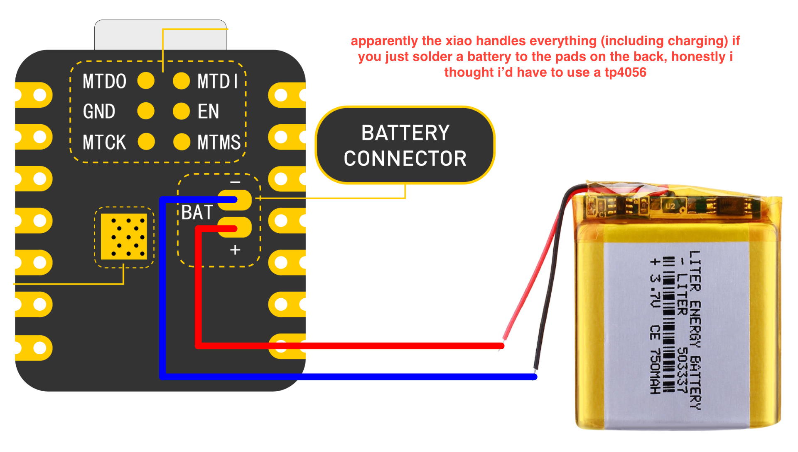
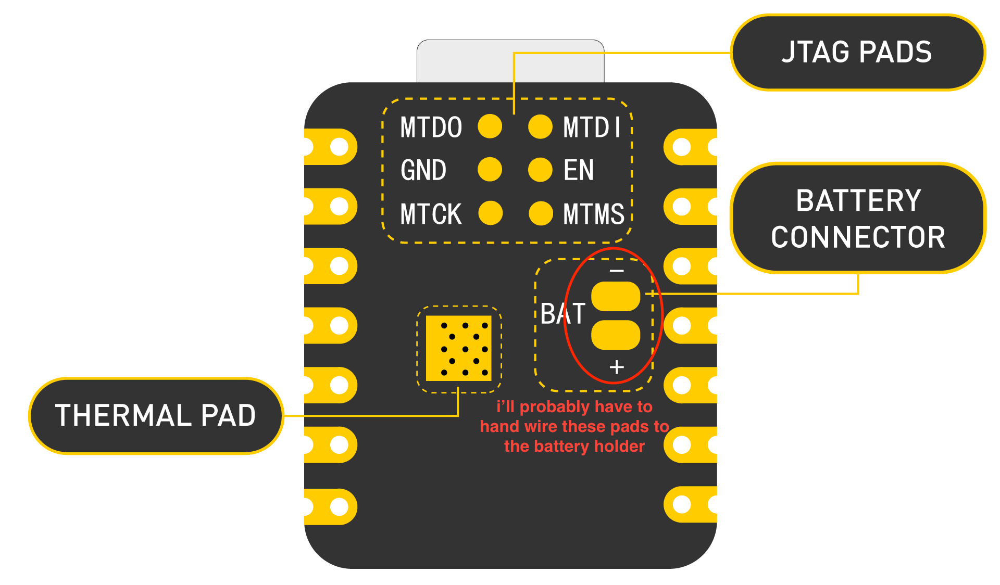
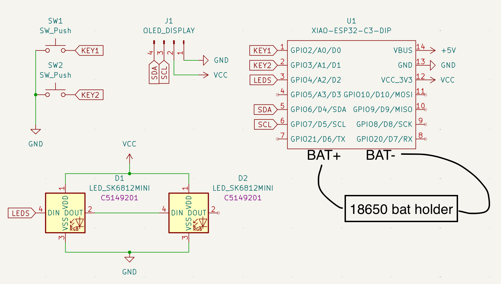
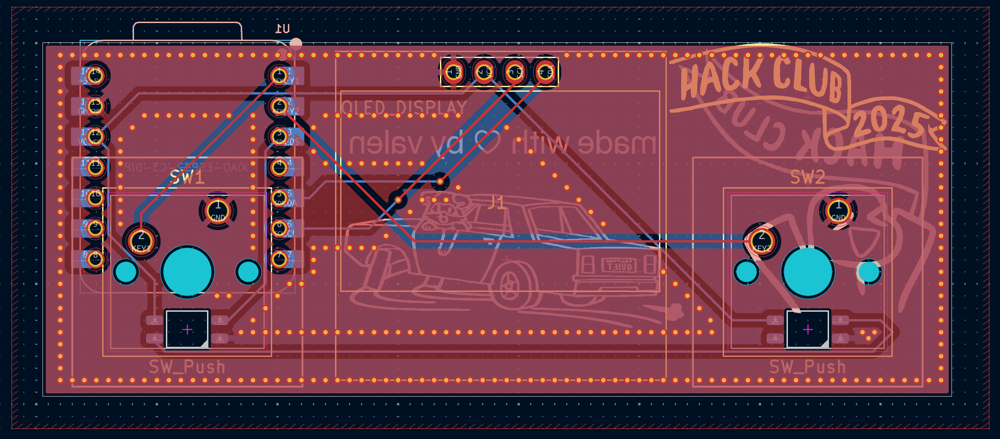
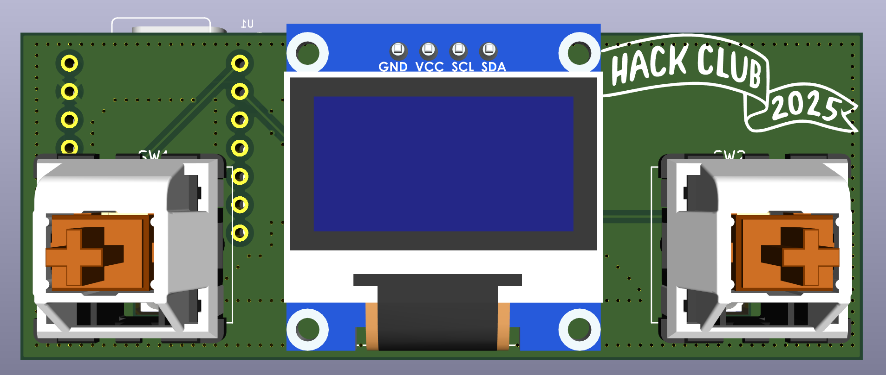
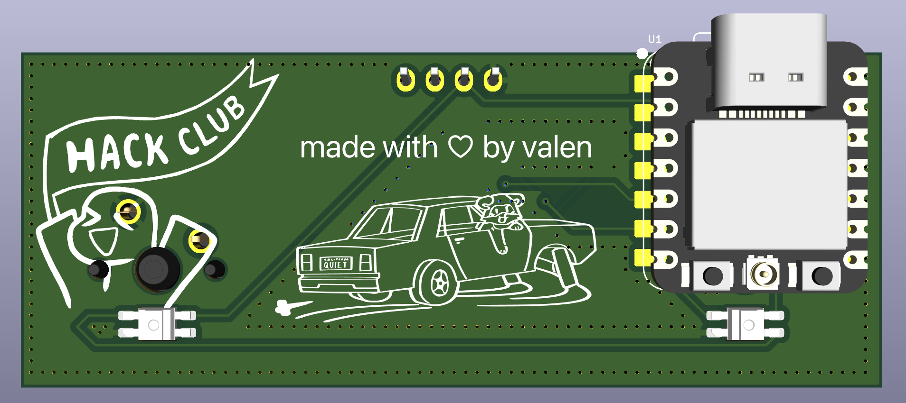
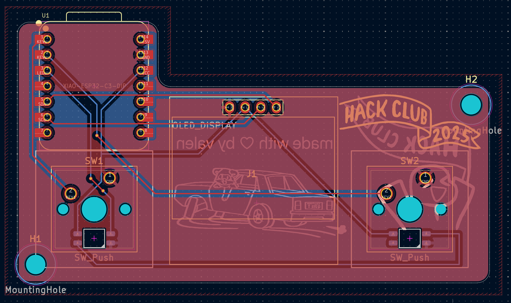
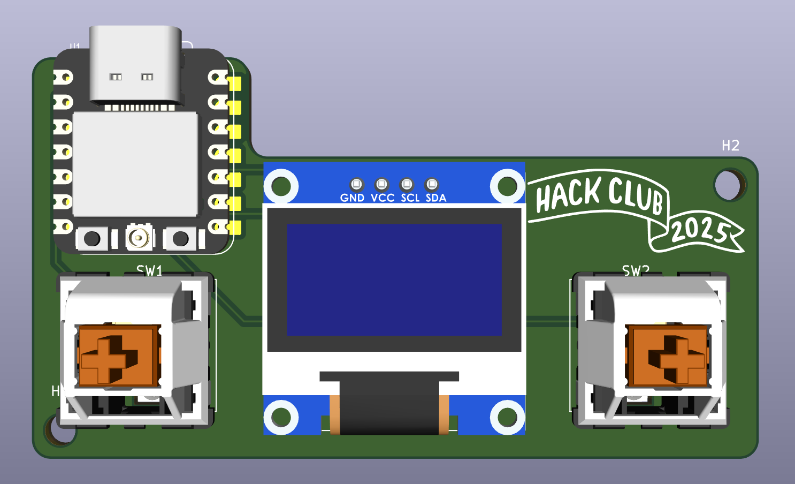
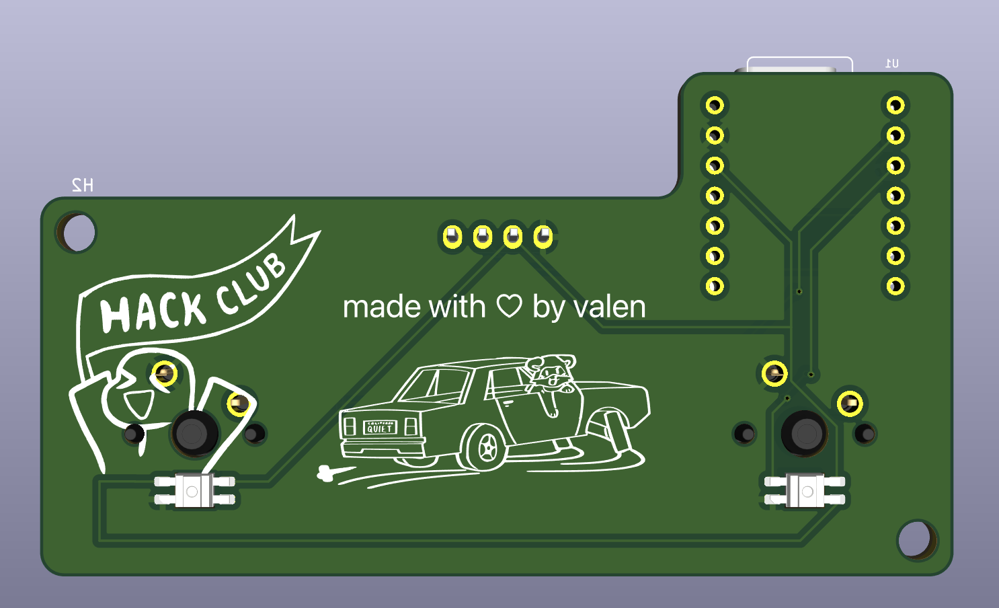
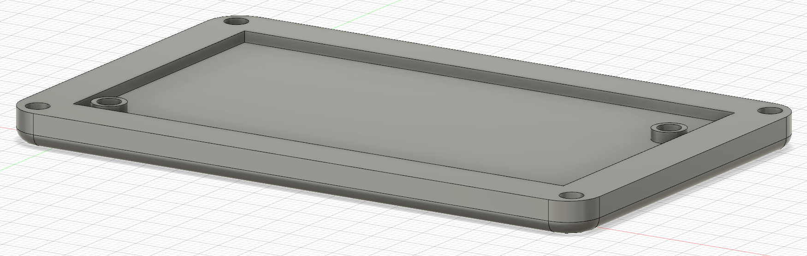

### Total time spent: 11h

# June 20: Started project planning

Today I started planning how I'm going to design my project and what components I'll use. I might change them later, but for now I'm looking at using: Seeed Studio XIAO RP2040 or any other RP2040 based board as MCU (could also use bare chip but I'm not sure if it's worth the hassle), 0.96in 128x64 OLED as display, two keyswitches to start and stop the timer, and a Li-Po or Li-Ion battery with a TP4056 charging module (I still need to research a lot about this).

The solve history will be stored on the XIAO's onboard flash, but for now I'm not completely sure how I'd visualize that data since connecting to a PC via USB is a bit cumbersome just to see your solves. I still have to figure that out, I was thinking of making it so you can view your average solve times and past solves from the timer itself but maybe having a way of seeing everything from your phone would be more convenient, I'd probably have to change the MCU for that though.

Tomorrow I'm going to research more about integrating a battery into my project, I'll start with my schematic and now that I'm writing this I'm considering changing the MCU to an ESP32 based board to have a web server so turns out I don't have everything as planned as I thought I did lol

Really excited for tomorrow!! :D didn't add any images since today was mostly planning, design and research

**Time spent this session: 1h**

# June 21: More research and new MCU choice

I was hoping I'd be able to start with my schematic today, but I spent most of the day at my grandparents house and didn't have my laptop on me. What I was able to do from my phone though is a lot of research, and I think with all the information I have now I can finally start doing the schematic and maybe even start the PCB tomorrow.

I've decided that I'm going to be using the XIAO ESP32C3 as the MCU for this project. It only costs $4.90 and it has a built-in battery charging circuit, (I spent quite a lot of time researching how to do it manually with a TP4056 only to find out the xiao handles everything 😭) it supports WiFi so I can sync my solve history with my phone using a web server and it also has more flash storage.

What I have to figure out now is how I'll wire the 18650 battery holder to the BAT pads on the back of the xiao, since I'm soldering headers to the xiao and the pads on the back are flat, probably meant for SMD soldering. Maybe I could just make a hole on the PCB to be able to access the pads from the back, but they wouldn't be touching the PCB so that would make them harder to reach. I'll figure something out tomorrow

If I take into account all the time I spent researching how to do this it'd probably amount to like 3 or 4 hours, but since it wasn't a whole uninterrupted session and basically I only did some research whenever I had free time let's call it 2 hours.

PS: I love how well documented xiao boards are, not only that but the docs also include a lot of resources like schematics of the board, 3D models, DXF files with dimensions, and a lot of useful stuff

**Time spent this session: 2h**

# June 22: Started (and finished) schematic

I was finally able to start my schematic today, and I finished it since it's way simpler than I thought. Here it is: (I added the battery holder myself since my symbol doesn't include the BAT pins and I'm probably going to hand wire it)

I also tried starting with the PCB but spent way more time than I should've gathering footprints so not even worth it including a screenshot 😭

Talking about the PCB, I have to figure out where I'm going to position all the components since I want to keep my PCB as small as possible. I was thinking about mounting the xiao on the back of the switches but I'm not sure it'd work, and soldering the battery pads would still be a problem if the switches are under the xiao.

Thinking about it maybe I'll do the CAD before the PCB so I have a better idea of how much space I'm working with and where to place the battery holder (I'm really overthinking this literally spent a whole hour looking into the battery aspect today lmao)

This tuesday I'll work some more on the PCB and look into doing the CAD, it's really hard for me but it motivates me to learn :D (hopefully I stop procrastinating on Slack instead of working on my project lol)

**Time spent this session: 2h**

# June 24: Did the PCB!! (v1 at least)

Finally started and finished my PCB! It's really simple but it should work, I might change it later though since I'm not 100% sure what I'm trying to do will work. Here's the PCB both in PCB editor and 3D viewer:

Honestly what took me the most amount of time was doing the silkscreen, routing wasn't too hard since there aren't many components. Also this time I used a ground plane unlike with my hackpad PCB and it honestly makes it so much easier not having to route GND, and I added stitching vias (not sure if I did it correctly, from my understanding that's how stitching vias work).

What I'm not really sure about is the position of the components, I don't know if I can place the xiao under a keyswitch. Also what I'll probably do for the battery pads is just hand wire them to the battery holder since I'd have some space considering the headers (I'm thinking wiring battery, then soldering headers).

I'll start with the CAD now but before that I have to make sure I won't have any problems with the xiao's position, maybe I'll change it since I have to leave space for the battery holder anyways.

I'll put a lot of effort into making the case so it looks polished, hate doing CAD but I mean it's a skill I have to learn 😭

**Time spent this session: 2h**

# June 27: PCB v2 and started the case

I've been thinking about the position of the xiao (on the back of a switch) and I decided not to risk it since it would probably make soldering everything much more harder, and after all I would still need to leave some space in the case for the battery holder so it doesn't make too much of a difference. Here are photos of my PCB (v2, maybe I'll change the silkscreen and add more art but if everything goes well it shouldn't change much):

Forgot to mention, I also added some filleted corners and mounting holes to keep the PCB in place.

I started doing the case design but I'm honestly not 100% sure of how I'll do it and where I'll position the screw holes, I guess I'm figuring it out as I'm designing it but for now this is all I did for the case (might change it, I'm really bad with CAD lol):

I have to work on the case now, I think I'll end up spending more time thinking how to mount everything than actually designing it haha

PCB should be fine as it is right now, only thing I could add is some holes in the PCB so that the battery pads are reachable from the back of the board but I'll try to focus on the case right now as I'm tired of doing only the PCB 😭

**Time spent this session: 3h**

# June 28: Still trying to figure out how I'm going to do the case

I tried to continue the case but honestly everything just confuses me. I'm not quite sure how and where to place holes for the heatset inserts or basically do anything at all 😭

I'll try and see how to approach this since the battery holder is way bigger than I expected, especially considering how small my PCB is. What I might do is put it under the PCB since it's only about 2cm tall from what I could find, and all measurements in Fusion being in mm makes everything seem so much bigger than it actually is.

Hopefully I figure out a way to do my case because CAD is definitely not as easy as I thought lol

**Time spent this session: 1h**
